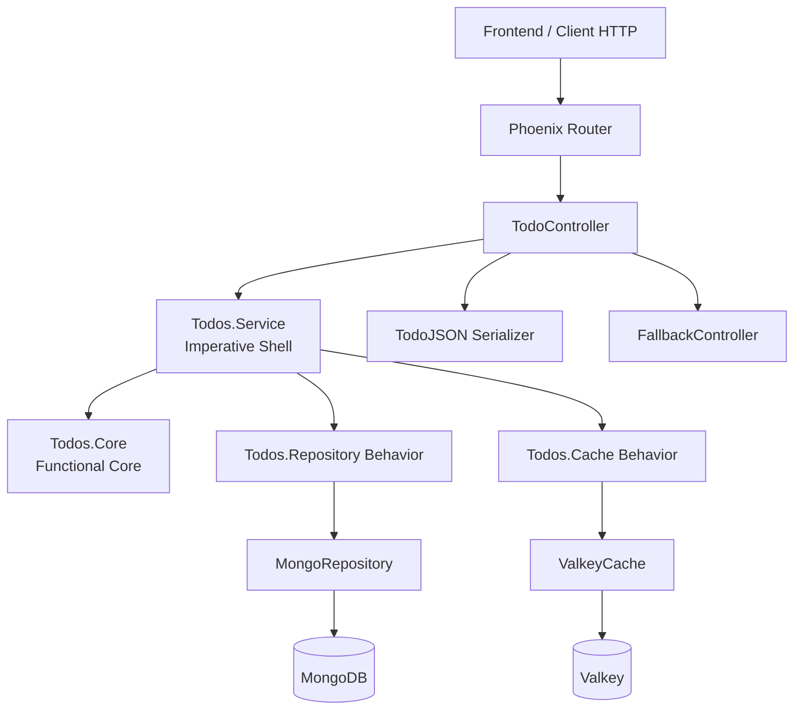

# Todo API (Backend)

## O que este projeto faz
Este serviço expõe uma API REST para gerenciamento de tarefas (todos), com persistência em MongoDB e cache de listagens em Valkey.

A API oferece:
- CRUD completo de tarefas.
- Filtros e paginação para listagem.
- Validação de entrada com erros estruturados.
- Cache de listagem com invalidação após escrita.

## Como este backend está organizado
A aplicação segue o padrão Functional Core, Imperative Shell:
- Core funcional: regras de negócio puras e validações.
- Shell imperativo: orquestração de I/O com repositório e cache.
- Camada web: controllers, serialização JSON e fallback de erros.

### Diagrama de arquitetura


## Tech stack
- Elixir 1.19
- Phoenix 1.8 (API-only)
- Bandit (HTTP server)
- mongodb_driver
- Redix (Valkey)
- Jason
- CORSPlug

## Rotas disponíveis
Base path: `/api`

### Health
- `GET /api/health`

Resposta:
```json
{
  "status": "ok"
}
```

### Todos
- `GET /api/todos`
- `GET /api/todos/:id`
- `POST /api/todos`
- `PATCH /api/todos/:id`
- `DELETE /api/todos/:id`

#### Query params de listagem (`GET /api/todos`)
- `page` (default: 1)
- `page_size` (default: 20, máximo: 100)
- `done` (`true` ou `false`)
- `priority` (`low`, `medium`, `high`)
- `q` (busca em `title` e `description`)
- `tags` (CSV: `tag1,tag2`)

#### Payload de criação (`POST /api/todos`)
Aceita payload direto ou aninhado em `todo`.

Exemplo:
```json
{
  "title": "Implementar cache",
  "description": "Adicionar cache de listagem",
  "done": false,
  "due_date": "2026-04-20T00:00:00Z",
  "priority": "high",
  "tags": ["backend", "cache"]
}
```

#### Payload de atualização (`PATCH /api/todos/:id`)
Todos os campos são opcionais.

Exemplo:
```json
{
  "priority": "medium",
  "done": true
}
```

#### Formato de resposta
- Listagem:
```json
{
  "data": [
    {
      "id": "...",
      "title": "...",
      "description": "...",
      "done": false,
      "due_date": null,
      "priority": "medium",
      "tags": ["api"],
      "inserted_at": "2026-04-10T20:35:36.935826Z",
      "updated_at": "2026-04-10T20:35:36.935826Z"
    }
  ],
  "meta": {
    "page": 1,
    "page_size": 20,
    "total": 1
  }
}
```

- Item único:
```json
{
  "data": {
    "id": "...",
    "title": "...",
    "description": "...",
    "done": false,
    "due_date": null,
    "priority": "medium",
    "tags": [],
    "inserted_at": "...",
    "updated_at": "..."
  }
}
```

#### Erros
- `404` para recurso não encontrado.
- `422` para validação e id inválido.
- `500` para erro interno.

Exemplo de erro de validação:
```json
{
  "error": {
    "code": "validation_error",
    "details": {
      "title": ["is required"]
    }
  }
}
```

## Como rodar
### Opção 1: Docker Compose (recomendado)
No diretório raiz do monorepo:
```bash
docker compose up -d --build
```

Se a porta `5173` já estiver ocupada, rode com:
```bash
FRONTEND_PORT=5174 docker compose up -d --build
```

A API ficará em:
- `http://localhost:4000/api`

### Opção 2: Local (sem Docker)
No diretório `backend`:
```bash
mix deps.get
mix phx.server
```

Pré-requisitos locais:
- MongoDB e Valkey disponíveis com as variáveis de ambiente corretas.

## Comandos úteis
No diretório `backend`:
```bash
mix format
mix test
mix test --include integration
mix compile --warnings-as-errors
```
